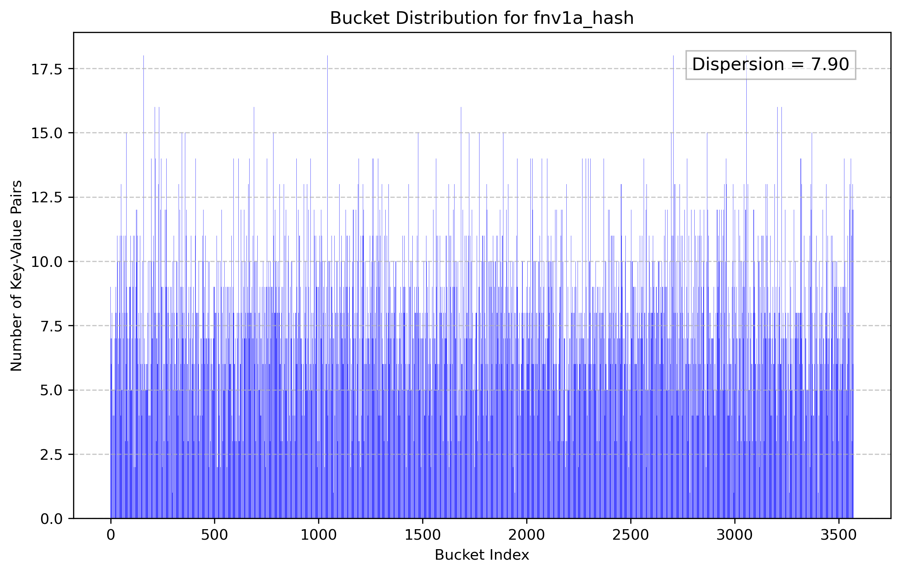
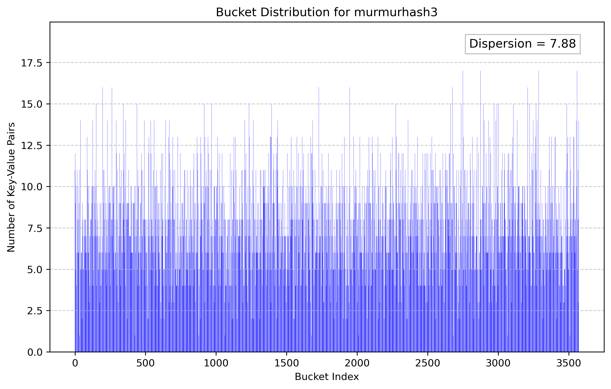
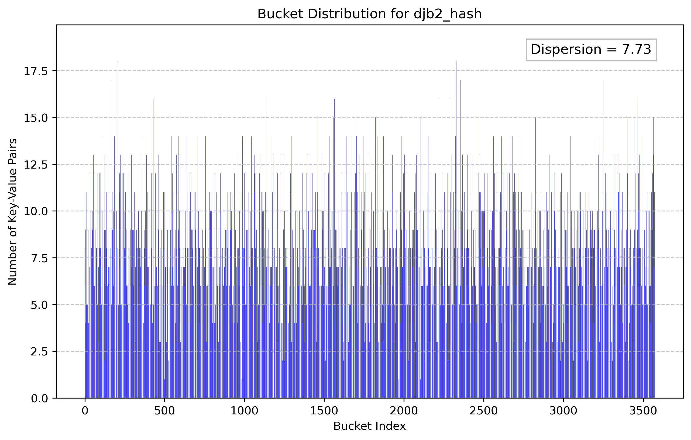
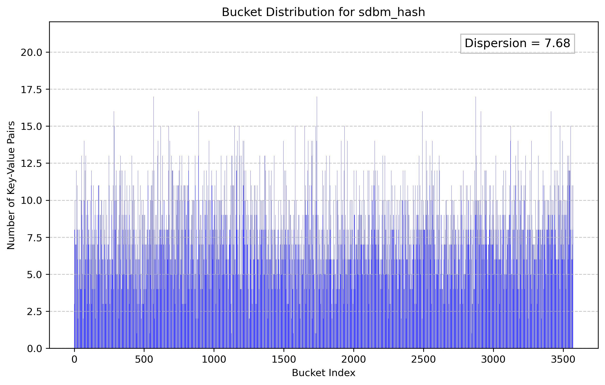
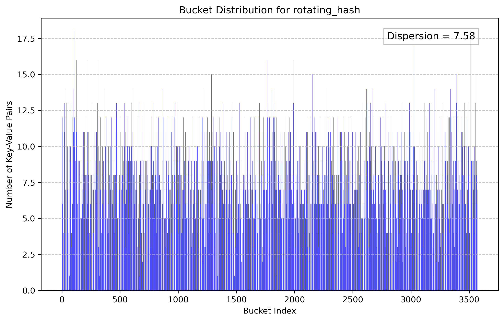
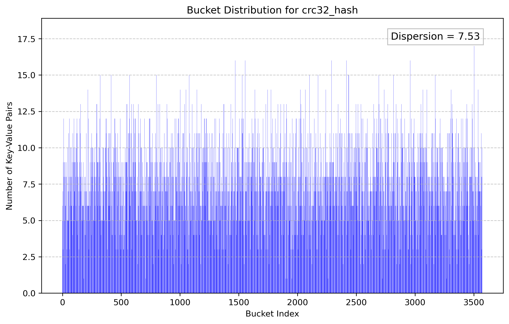
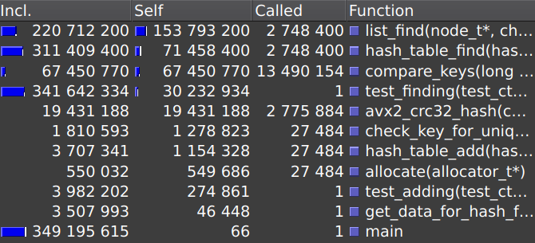
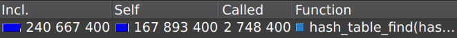
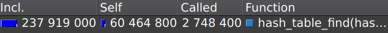

# Поиск и оптимизация узких мест в хеш-таблице

## Содержание

<div class="toc">
  <div class="toc-item">1. <a href="#1-цель-работы">Цель работы</a></div>
  <div class="toc-item">2. <a href="#2-задачи">Задачи</a></div>
  <div class="toc-item">3. <a href="#3-теоретическая-часть">Теоретическая часть</a></div>
  <div class="toc-item">
    <div>4. <a href="#4-практическая-часть">Практическая часть</a></div>
    <div class="toc-subitem">&emsp;&emsp;4.1 <a href="#41-тестирование">Тестирование</a></div>
    <div class="toc-subitem">&emsp;&emsp;4.2 <a href="#42-поиск-узких-мест">Поиск узких мест</a></div>
    <div class="toc-subitem">&emsp;&emsp;4.3 <a href="#43-оптимизация-хеш-функции">Оптимизация хеш-функции</a></div>
    <div class="toc-subitem">&emsp;&emsp;4.4 <a href="#44-оптимизация-векторизацией">Оптимизация векторизацией</a></div>
    <div class="toc-subitem">&emsp;&emsp;4.5 <a href="#45-оптимизация-с-помощью-ассемблера">Оптимизация с помощью ассемблера</a></div>
    <div class="toc-subitem">&emsp;&emsp;4.6 <a href="#46-смена-флага-оптимизации">Смена флага оптимизации</a></div>
  </div>
  <div class="toc-item">5. <a href="#5-итоги">Итоги</a></div>
  <div class="toc-item">6. <a href="#6-библиография">Библиография</a></div>
</div>

## 1. Цель работы

- Научиться работать с профилировщиком, а именно искать узкие места в программе.
- Оптимизировать программу различными методами, а именно
  - Векторизация
  - Ассемблер

## 2. Задачи

1. Реализовать базовую версию хеш-таблицы.
2. Подготовить данные для тестирования работы хеш-таблицы.
3. Проанализировать производительность базовой реализации с помощью профилировщика.
4. Оптимизировать узкие места в программе.
5. Провести сравнительный анализ производительности до и после оптимизаций.

## 3. Теоретическая часть

***Хеш-таблица*** — структура данных, реализующая интерфейс ассоциативного массива, а именно она позволяет хранить пары (ключ, значение) и выполнять три операции: добавление новой пары, удаление и поиск пары по ключу. В данной работе хеш-таблица поддерживает только операции добавления и поиска. [[6]](#bib6)

Существуют два основных варианта хеш-таблиц: с открытой адресацией и списками.

Выполнение операции в хеш-таблице начинается с вычисления хеш-функции от ключа. Получающееся хеш-значение играет роль индекса в массиве. Затем выполняемая операция (добавление или поиск) перенаправляется объекту, который хранится в соответствующей ячейке массива (**bucket**). В данной работе хеш-таблица реализована методом цепочек, то есть выполняемая операцию передаётся соответствующему списку.

*Добавление элемента* происходит в начало соответствующего списка. Таким образом алгоритмическая сложность добавления элемента равна O(1).

*Поиск элемента* реализуется по значению ключа, поскольку хеш-ключи у элементов одинаковы.
При предположении, что каждый элемент может попасть в любую ячейку таблицы с равной вероятностью и независимо от того, куда попал любой другой элемент, алгоритмическая сложность операции поиска элемента равна $O(1 + λ)$, где $λ$ — коэффициент заполнения таблицы (load factor), который равен отношению числа хранимых элементов к размеру таблицы.

Важным параметром хеш-таблицы является хеш-функция, поскольку от её выбора зависит количество ***коллизий*** — ситуаций, когда для различных ключей хеш-функция возвращает одно и то же значение.

## 4. Практическая часть

### 4.1 Тестирование

Для тестирования работы хеш-таблицы были выбраны текста произведений Джона Толкина и Льва Николаевича Толстого. Ключом элемента в хеш-таблице является слово, значением — количество повторений этого слова в тексте без учёта регистра. Тестирование состоит в том, чтобы добавить все пары в хеш-таблицу, а потом найти значение для каждого ключа и проверить, что оно совпадает с добавленным. Поиск по всем элементам запускается в 100 раз.

Время выполнения программы может зависеть от системы, на которой эта программа исполняется, поэтому необходимо указать параметры системы, на которой проводились измерения.

<table>
<tr>
  <td>Процессор</td>
  <td>AMD Ryzen 7 8845H</td>
</tr>
<tr>
  <td>ОС</td>
  <td>Ubuntu 24.04</td>
</tr>
<tr>
  <td>ОЗУ</td>
  <td>32 Гб</td>
</tr>
<tr>
  <td>Компилятор</td>
  <td>gcc 13.3.0</td>
</tr>
</table>

### 4.2 Поиск узких мест

***Узким местом*** называется кусок кода, на который затрачивается значительная доля процессорного времени, если затрачиваемое время возможно сократить, оптимизировав этот код.

Для поиска узких мест в программе необходимо составить профиль программы. Этим занимается ***профилировщик***. В данной работе я использовал профилировщик **valgrind**, а для графической визуализации профиля программы **kcachegrind**.

### 4.2 Базовая реализация

Логика работы хеш-таблицы была описана в [теоретической части](#3-теоретическая-часть). Осталось только выбрать подходящую хеш-функцию, чтобы коллизий было как можно меньше. Чем меньше сильных коллизий, тем меньше дисперсия — среднеквадратичное отклонение. Поэтому основным параметром выбора хещ-функции будет дисперсия. Проведем исследование распределений количества элементов в каждом бакете хеш-таблицы в зависимости от хеш-функции.

<div align="center">
  
</div>

<div align="center">
  
</div>

<div align="center">
  
</div>

<div align="center">
  
</div>

<div align="center">
  
</div>

<div align="center">
  
</div>

Как видно из графиков, минимальное значение дисперсии у распределения хеш-функции crc32. Поэтому она и будет использоваться.

### 4.3 Оптимизация хеш-функции

Проанализируем профиль программы в базовой реализации. На картинке снизу изображена часть интерфейса утилиты kcachegrind, которая визуализирует профиль программы, полученный профилировщиком valgrind.

<div align="center">
  <strong>Профиль программы в базовой реализации</strong><br>
  
</div>

Столбец **Incl** содержит в себе информацию о количестве тактов процессора (далее полное время выполнения), затраченное на исполнение функции в столбце **Function** с учетом времени исполнения функций, вызванных в ней. Столбец **Self** содержит в себе ту же информацию, но уже без учета времени исполнения других функций (далее собственное время выполнения). В столбце **Called** можно видеть сколько раз данная функция была вызвана.

Наиболее содержательным является столбец **Self**. Именно он позволяет найти узкие места. Чем больше значение **Self**, тем "уже" место.

Понятно, что главной целью оптимизации хеш-таблицы является функция поиска элемента, так как именно она чаще всего используется в хеш-таблице, а добавление элементов обычно происходит при инициализации. Поэтому время выполнения функции ***hash_table_find*** будет объективным параметром скорости работы хеш-таблицы.

Как видно из скрина выше узким местом является функция ***crc32_hash***. Её собственное время исполнения сильно больше чем у других функций.

В базовой реализации для хеширования была выбрана функция crc32. Этот выбор не случайный. Так как crc32 — очень популярная хеш-функция, используемая для защиты данных, она реализована на аппаратном уровне в виде ассемблерной инструкции.

***Базовая реализация crc32_hash***
```c
uint32_t crc32_hash(char* str)
{
    static uint32_t* crc32_table = init_crc32_table();
    uint32_t         crc         = 0xFFFFFFFF;

    int i = 0;
    while (str[i] != '\0') {
        crc = (crc >> 8) ^ crc32_table[(crc ^ str[i++]) & 0xFF];
    }

    return crc ^ 0xFFFFFFFF;
}
```

Подробнее почитать про реализацию алгоритма ***crc32_hash*** и о том, что такое ***crc32_table*** можно здесь [[2]](#bib2).

Оптимизируем функцию, используя интринсик `_mm_crc32_u8`.

***Реализация crc32_hash с интринсиком***
```c
uint32_t crc32_hash(char* str)
{
    uint32_t crc = 0;

    int i = 0;
    while (str[i] != '\0') {
        crc = _mm_crc32_u8(crc, str[i++]);
    }

    return crc;
}
```

Посмотрим теперь, как данная реализация оптимизировала программу.

<div align="center">
  <strong>Профиль программы с оптимизацией хеш-функции</strong><br>
  
</div>

Полное время выполнения ***crc32_hash*** уменьшилось в $\frac{256\,282\,459}{125\,365\,341}$ ≈ $2.04$ раза.

<div align="center">
  <strong>Полное время выполнения hash_table_find в базовой реализации</strong><br>
  
</div>

<div align="center">
  <strong>Полное время выполнения hash_table_find с оптимизацией хеш-функции</strong><br>
  
</div>

Полное время выполнения ***hash_table_find*** уменьшилось в $\frac{825\,069\,300}{697\,271\,000}$ ≈ $1.18$ раза

### 4.4 Оптимизация векторизацией

Как видно из профиля программы с оптимизацией хеш-функции, ***crc32_hash*** все еще остается узким местом в программе. Однако мы пока не можем её ускорить ещё больше. Для дальнейшего анализа посмотрим на профиль программы с учетом всех функций. Для этого надо сменить вид в kcachegrind с ***Source file*** на ***(No Grouping)***.

<div align="center">
  <strong>Профиль программы с оптимизацией хеш-функции (**No** Grouping)</strong><br>
  
</div>

Становится понятно, что самым узким местом является сравнение ключей по значению. Раньше этого не было видно, так как в собственное время выполнения функции compare_keys не входит время выполнения функции ***__strcmp_avx2***. Заметим, также что название ***__strcmp_avx2*** дает серьезную подсказку к дальнейшей оптимизации.

В данной версии программы ключи хранятся как строки и для их сравнения используется библиотечная функция strcmp. Однако реализована она совсем не просто.

Вместо медленного побайтового сравнения строковыми функциями ***strcmp*** загружает части строки в широкие регистры. При этом предварительно нужно проверить, что такая загрузка не затронет память, к которой нет доступа. Сравнение широких регистров значительно ускоряет сравнение, так как обрабатывается сразу несколько байт. Однако если среди загруженных байтов есть 0, то либо был загружен конец строки, либо вместе с концом строки было загружено что-то лишнее, что не подлежит сравнению. В таком случае нужно перейти к регистрам меньшего размера. Подробнее о векторизации ***strcmp*** можно почитать здесь [[3]](#bib3).

Из написанного выше становится ясно, что ***__strcmp_avx2*** тратит много ресурсов на различные проверки. Однако, это даёт идею новой оптимизации — векторизация.

Изменив идеологию хранения ключей можно значительно ускорить работу программы. Так как максимальный размер строки в обрабатываемом файле равен 18, можно хранить ключи в ymm регистрах, размер которых равен 32 байта. В общем случае это конечно неподходящее решение, но слова больше чем 32 байта встречаются очень редко, так что такая оптимизация будет оправданной.

***Базовая реализация compare_keys***
```c
bool compare_keys(char* ptr_to_etalon_key, char* ptr_to_key)
{
    return !strcmp(ptr_to_etalon_key, ptr_to_key);
}
```

***Векторизация compare_keys***
```c
bool compare_keys(__m256i etalon_key, char* ptr_to_key)
{
    __m256i key = _mm256_load_si256((__m256i*) ptr_to_key);

    __m256i cmp_mask = _mm256_cmpeq_epi8(etalon_key, key);

    int mask = _mm256_movemask_epi8(cmp_mask);

    return mask == 0xffffffff;
}
```

В данной реализации необходимо обеспечить дополнение строк до 32 байт незначащими нулями. Также для использования быстрой загрузки из памяти в `__m256i` нужно выравнивать строки по 32 байта.

Также нужно изменить логику программы с учетом того, что ключи теперь лежат в `__m256i`. В том числе нужно переписать функцию ***crc32_hash***.

***Векторизация crc32_hash***
```c
uint32_t avx2_crc32_hash(char* ptr_to_key)
{
    uint32_t crc = 0;

    for (int i = 0; i < 4; i++) {
        crc = _mm_crc32_u64(crc, *((uint64_t*) ptr_to_key));
        ptr_to_key += 8 * i;
    }

    return crc;
}
```

Посмотрим теперь, как данная реализация оптимизировала программу.

<div align="center">
  <strong>Профиль программы с оптимизацией векторизацией</strong><br>
  
</div>

Полное время выполнения ***compare_keys*** уменьшилось в $\frac{411\,960\,907}{67\,188\,675}$ ≈ $6.13$ раза.

Полное время выполнения ***crc32_hash*** уменьшилось в $\frac{125\,365\,341}{19\,431\,188}$ ≈ $6.45$ раза.

<div align="center">
  <strong>Полное время выполнения hash_table_find с оптимизацией векторизацией</strong><br>
  
</div>

Полное время выполнения ***hash_table_find*** уменьшилось в $\frac{697\,271\,000}{310\,734\,700}$ ≈ $2.24$ раза

### 4.5 Оптимизация с помощью ассемблера

Как видно из профиля программы с оптимизацией векторизацией, узким местом новой реализации является функция хеш-функция ***list_find***.

***Базовая реализация list_find***
```c
hash_table_status_t list_find(node_t* list, char* ptr_to_etalon_key, data_t* result)
{
    __m256i etalon_key  = _mm256_load_si256((__m256i*) ptr_to_etalon_key);

    node_t* current_elem = list;

    while (current_elem) {
        if (compare_keys(etalon_key, current_elem->key)) {
            *result = current_elem->data;
            return HASH_TABLE_SUCCESS;
        }
        current_elem = current_elem->next;
    }

    return HASH_TABLE_FIND_FAILURE;
}
```

Вроде бы оптимизировать тут нечего, но, взглянув на ассемблерный код данной функции в том же **kcachegrind**, можно заметить кое-что интересное.

<div align="center">
  <strong>Ассемблерный код функции list_find</strong><br>
  
</div>

Среди них есть одна странная вещь, а именно инструкция `vmovdqa (%rsi), %ymm1`. Смысл её понятен — загрузка значения `etalon_key` из памяти (адрес в `%rsi`) в регистр `ymm1`. Странность заключается в том, что компилятор таким образом делает лишнее действие. Значение из `%ymm1` потом кладётся в регистр `%ymm0`, так как по соглашениям о вызовах первый 256-битный параметр функции должен быть в `%ymm0`. То есть регистр `%ymm1` здесь просто-напросто не нужен. Более того, инструкция `vmovdqa %ymm1, %ymm0` находится в цикле и исполняется 133 319 раз (столбик **Ir** содержит информацию о том, сколько раз исполнялась инструкция из Assembly instructions), что составляет вместо с ненужной инструкцией `vmovdqa (%rsi), %ymm1` ≈ $9.6\%$ собственного времени работы функции ***list_find***. Казалось бы, флаг оптимизации **-O2** должен устранить подобные вещи, но почему-то этого не делает. Кстати, с **-O3** ситуация такая же.

Написав функцию ***list_find*** на ассемблере можно избавиться от этой проблемы. Также можно убрать инструкции в начале функции, нужных для стекового фрейма [[5]](#bib5), так как написав код вручную можно оптимально использовать регистры вместо локальных переменных. Также если ещё написать функцию ***compare_keys*** на ассемблере, можно избавиться от инструкции `mov (%rcx), rdi`, которая нужна для соблюдения соглашений о вызовах [[4]](#bib4). Эта инструкция также выполняется в цикле, поэтому прирост будет значительным.

***list_find и compare_keys на ассемблере***
```asm
section .text
global list_find
global compare_keys

; ----------------------------------------------------------------------------------------
; hash_table_status_t list_find(node_t *list, char *ptr_to_etalon_key, data_t *result)
;
; Entry: rdi = node_t* list
;        rsi = char*   ptr_to_etalon_key
;        rdx = data_t* result
;
; Exit:  rdx = &result (if successful)
;        eax = status
;
; Destr: ymm0, rbx, rdi, rdx
; ----------------------------------------------------------------------------------------
list_find:
    ; __m256i etalon_key  = _mm256_load_si256((__m256i*) ptr_to_etalon_key);
        vmovdqa ymm0, [rsi]

    ; save rbx because caller uses it
        push rbx

    ; node_t* current_elem = list;
        mov rbx, rdi

    ; while (current_elem)
    .while_loop:
        test    rbx, rbx
        jz      .while_end

    ; bool cmp_result = compare_keys(etalon_key, current_elem->key)
        mov rdi, [rbx]
        call compare_keys

    ; if (cmp_result)
        test al, al
        jnz .find_successful

    .find_failed:
    ; current_elem = current_elem->next;
        mov rbx, [rbx + 16]
        jmp .while_loop

    .find_successful:
    ; *result = current_elem->data;
        mov rax, [rbx+8]
        mov [rdx], rax

    ; restore rbx
        pop rbx

    ; return HASH_TABLE_SUCCESS
        mov eax, 0
        ret

    .while_end:
    ; restore rbx
        pop rbx

    ; return HASH_TABLE_FIND_FAILURE
        mov eax, 2
        ret

; ----------------------------------------------------------------------------------------
; bool compare_keys(__m256i etalon_key, char* ptr_to_key)
;
; Entry: ymm0 = etalon_key
;        rdi  = ptr_to_key
;
; Exit:  al = result
;
; Destr: ymm0
; ----------------------------------------------------------------------------------------
compare_keys:

    ;__m256i key = _mm256_load_si256((__m256i*) ptr_to_key);
        vpcmpeqb ymm1, ymm0, [rdi]

    ; __m256i cmp_mask = _mm256_cmpeq_epi8(etalon_key, key);
        vpmovmskb eax, ymm1

    ; int mask = _mm256_movemask_epi8(cmp_mask);
    ; inc eax <=> cmp  eax, 0FFFFFFFFh
        inc eax
        setz al
        retn
```

Также можно заметить ещё одну интересную вещь. Если взглянуть на возвращаемое значение в ***compare_keys*** и на его обработку в ***list_find***, можно понять, что на самом деле сохранение результата сравнения в al `setz al` избыточно.

В функции `compare_keys` `inc eax` устанавливает флаг нуля в 1, если `eax` равен `0FFFFFFFFh`. То есть флаг нуля установлен в 1, если значения ключей совпали. В функции `list_find` После вызова функции `compare_keys` команда `jnz .find_successful` переходит по метке, если флаг нуля равен 0. Если заменить `jnz` на `jz`, то результат ***compare_keys*** будет обрабабатываться верно без использования al.

Однако есть нюанс, который состоит в том, что ***compare_keys*** вызывается не только из ***list_find***, но и из ***check_key_for_uniqueness***, вызываемой из функции добавления элемента ***hash_table_add***.

```c
hash_table_status_t check_key_for_uniqueness(char* ptr_to_key, node_t* list)
{
    __m256i key  = _mm256_load_si256((__m256i*) ptr_to_key);

    node_t* current_elem = list;

    while (current_elem) {
        if (compare_keys(key, current_elem->key)) {
            return HASH_TABLE_SAME_KEY_ERROR;
        }

        current_elem = current_elem->next;
    }

    return HASH_TABLE_SUCCESS;
}
```

Для правильной обработки `if` в ***check_key_for_uniqueness*** требуется, чтобы результат был записан в al. Поэтому нельзя просто убрать лишнюю инструкцию `setz al, al` в ***compare_keys***. Нужно ещё поменять логику работы ***check_key_for_uniqueness***.

Для этого можно написать ***check_key_for_uniqueness*** на ассемблере так же как было сделано с ***list_find***, убрав заодно лишние инструкции, связанные с локальными переменными и загрузки параметров в функцию ***compare_keys***. Однако ***check_key_for_uniqueness*** используется в функции добавления элемента, которая используется обычно намного реже в хеш-таблицах чем функция поиска. Поэтому прирост в производительности будет не оправдан. Ассемблерного кода лучше избегать, так как он приводит к несовместимости и нетривиальным ошибкам. Например с новой реализацией `list_find` нельзя менять порядок полей в структуре `node_t`.

Поэтому модифицируем ***check_key_for_uniqueness*** с помощью ассемблерных вставок.

```c
hash_table_status_t check_key_for_uniqueness(char* ptr_to_key, node_t* list)
{
    __m256i key  = _mm256_load_si256((__m256i*) ptr_to_key);

    node_t* current_elem = list;

    while (current_elem) {

        compare_keys(key, current_elem->key);

        asm volatile("jz .HASH_TABLE_SAME_KEY_ERROR");

        current_elem = current_elem->next;
    }

    int volatile result = 0;

    asm volatile("jmp .HASH_TABLE_SUCCESS");

    asm volatile(".HASH_TABLE_SAME_KEY_ERROR:"
                 "mov $1, %[result]"
                 : [result] "=r" (result)::);

    asm volatile(".HASH_TABLE_SUCCESS:");

    if (result) {
        return HASH_TABLE_SAME_KEY_ERROR;
    } else {
        return HASH_TABLE_SUCCESS;
    }
}
```

Посмотрим теперь, как данная реализация оптимизировала программу.

<div align="center">
  <strong>Профиль программы с оптимизацией ассемблером</strong><br>
  
</div>

Полное время выполнения ***list_find*** уменьшилось в $\frac{220\,037\,500}{163\,141\,300}$ ≈ $1.35$ раза.

<div align="center">
  <strong>Полное время выполнения hash_table_find с оптимизацией ассемблером</strong><br>
  
</div>

Полное время выполнения ***hash_table_find*** уменьшилось в $\frac{310\,734\,700}{240\,096\,500}$ ≈ $1.29$ раза

Хотелось бы обратить внимание, на то как было получено время выполнения ***list_find*** в ассемблерной реализации. Ведь в профиле программы его нет. Вместо этого возросло собственное время ***hash_table_find***. Всё дело в том, что ***hash_table_find*** не вызывает ***list_find*** как функцию, в ней находится `jmp` вместо `call`.

```c
hash_table_status_t hash_table_find(hash_table_t* hash_table,
                                    char*         ptr_to_etalon_key,
                                    data_t*       result)
{
    size_t index = hash_table->hash_function(ptr_to_etalon_key) % hash_table->size;
    node_t* list = hash_table->buckets[index].list;

    return list_find(list, ptr_to_etalon_key, result);
}
```

Из листинга выше становится понятно, почему компилятор использует `jmp` вместо `call`. Возвращение значения функции ***list_find*** эквивалентно `jmp` на неё. По этой причине приходится считать собственное время выполнения ***list_find*** вручную, с помощью данных в столбике **Ir** в ассемблерном коде функции в **kcachegrind**.

<div align="center">
  <strong>Ассемблерный код функции hash_table_find</strong><br>
  
</div>

Ассемблерный код функции ***list_find*** находится с `1E00` по `1E2A`. Посчитать полное время выполнения ***list_find*** можно по формуле:
```math
2\,748\,400\,\cdot\,3\,+\,13\,331\,900\,\cdot\,4\,+\,53\,327\,600\,+\,13\,331\,900\,+\,10\,583\,500\,\cdot\,2\,+\,2\,748\,400\,\cdot\,5\,=\,163\,141\,300
```

### 4.6 Смена флага оптимизации

Во время экспериментов с различными флагами оптимизации, был замечен один интересный момент. В функции ***list_find***, реализованной на ассемблере сохраняется регистр `rbx`, так как он является callee-saved [[4]](#bib4). Если его не сохранять, произойдёт **segfault**, так как регистр `rbx` используется, функциями над ***list_find***. Это происходит при компиляции программы с флагом оптимизации **-O2**. Однако если компилировать с **-O1** **segfault** не возникает.

Чтобы разобраться, что происходит, достаточно взглянуть на ассемблерный код функции ***hash_table_find*** при различных флагах оптимизации.

<div align="center">
  <strong>hash_table_find с флагом -O2</strong><br>
  
</div>

<div align="center">
  <strong>hash_table_find с флагом -O1</strong><br>
  
</div>

Как видно из кода в реализации **O2**, как было отмечено в конце предыдущего раздела, компилятор реализует вызов ***list_find*** через `jump`, а не через `call`, поэтому сохранённые регистры, в том числе `rbp` восстанавливаются до ***list_find***.

В реализации **O1** же ***list_find*** вызывается через `call`, поэтому регистры восстанавливаются после вызова ***list_find***. Таким образом "испорченный" `rbp` восстанавливается функцией ***hash_table_find***. Поэтому в реализации **-O1** можно не сохранять `rbp` в функции ***list_find***. Реализуем это и проанализируем результаты.

<div align="center">
  <strong>Полное время выполнения hash_table_find с оптимизацией ассемблером</strong><br>
  
</div>

Полное время выполнения ***hash_table_find*** уменьшилось в $\frac{240\,096\,500}{237\,348\,100}$ ≈ $1.01$ раза.

Данная оптимизация дала прирост в скорости всего ≈$1.1\%$. Однако она очень небезопасна. Тот факт, что логика работы программы зависит от флага оптимизации, делает данную реализацию неоправданной. Поэтому в конечную версию она не войдёт.

## 5. Итоги
В ходе проведённой работы использовался флаг компиляции `-fno-inline` для облегчения анализа профилировщика. Однако для конечной реализации, необходимо его отключить, чтобы получить объективный результат.

<div align="center">
  <strong>Полное время выполнения hash_table_find в базовой реализации</strong><br>
  
</div>

<div align="center">
  <strong>Полное время выполнения hash_table_find со всеми оптимизациями</strong><br>
  
</div>

Полное время выполнения ***hash_table_find*** уменьшилось в $\frac{742\,551\,500}{240\,096\,500}$ ≈ $3.09$ раза.

Таким образом, наиболее часто используемая операция хещ-таблицы была ускорена более чем в 3 раза.

Конечно, работу программы можно ускорить ещё сильнее. Однако в рамках оптимизации кода важно соблюдать баланс между повышением производительности и поддержанием кода в надлежащем состоянии. Чрезмерное использование низкоуровневых ассемблерных вставок, хотя и способно дать значительный прирост скорости, имеет ряд существенных ограничений:
- Снижение переносимости кода между различными аппаратными архитектурами

- Увеличение вероятности возникновения трудноуловимых ошибок

- Усложнение процесса модификации кода

Рациональный подход предполагает:

- Приоритетное использование стандартных методов оптимизации

- Осторожное применение ассемблерных вставок только в критически важных участках кода

Современные компиляторы в большинстве случаев способны генерировать высокоэффективный машинный код, не требуя прямого вмешательства в ассемблерные инструкции. Это позволяет сохранить баланс между производительностью и надёжностью кода.

## 6. Литература

<ul style="list-style-type: none; padding-left: 0;">
  <li><a id="bib1"></a>[1] <a href="https://www.intel.com/content/www/us/en/docs/intrinsics-guide/index.html">Intel® Intrinsics Guide</a></li>
  <li><a id="bib2"></a>[2] <a href="https://habr.com/ru/articles/770014/">Статья про crc32</a></li>
  <li><a id="bib3"></a>[3] <a href="https://www.strchr.com/strcmp_and_strlen_using_sse_4.2">Про векторизацию strcmp</a></li>
  <li><a id="bib4"></a>[4] <a href="https://refspecs.linuxfoundation.org/elf/x86_64-abi-0.99.pdf?spm=a2ty_o01.29997173.0.0.3c44c921my6cy8&file=x86_64-abi-0.99.pdf">System V ABI</a></li>
  <li><a id="bib5"></a>[5] <a href="https://ru.wikipedia.org/wiki/%D0%A1%D1%82%D0%B5%D0%BA%D0%BE%D0%B2%D1%8B%D0%B9_%D0%BA%D0%B0%D0%B4%D1%80">Про стековые фреймы</a></li>
  <li><a id="bib6"></a>[6] <a href="https://ru.wikipedia.org/wiki/%D0%A5%D0%B5%D1%88-%D1%82%D0%B0%D0%B1%D0%BB%D0%B8%D1%86%D0%B0">Про хеш-таблицу</a></li>
</ul>

